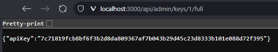

# Deployment Tracker Application

A simple web application for tracking deployments across different applications and regions (dev, test, prod, training).

## Features

- Track deployments across multiple applications and regions
- Add and manage applications through a user-friendly interface
- Filter and sort deployments by various criteria
- API key-based authentication
- Admin interface for managing API keys
- SQLite database for data storage
- Containerized deployment with Docker

## Project Structure

```ASCII
deployment-tracker/
├── data/                  # SQLite database files
├── public/                # Frontend assets
│   ├── js/                # JavaScript files
│   │   ├── config.js      # Application configuration
│   │   └── utils.js       # Shared utility functions
│   ├── admin/             # Admin interface
│   │   └── keys.html      # API key management
│   ├── add-deployment.html # Add new deployment form
│   ├── add-application.html # Add new application form
│   ├── index.html         # Main application page
│   └── styles.css         # Shared CSS styles
├── src/                   # Backend source code
│   ├── middleware/        # Express middleware
│   │   └── authMiddleware.js # API key authentication
│   ├── routes/            # API routes
│   │   ├── adminRoutes.js # Admin API endpoints
│   │   └── index.js       # Main API endpoints
│   ├── db.js              # Database connection and queries
│   ├── index.js           # Main application entry point
│   └── seed.js            # Database seeding
├── docker-compose.yml     # Docker Compose configuration
├── Dockerfile             # Docker image definition
└── package.json           # Node.js dependencies
```

## Frontend Architecture

The frontend is built with vanilla JavaScript and follows these principles:

1. **Centralized Configuration**: All configuration settings are stored in `public/js/config.js`
2. **Shared Utilities**: Common functions are extracted to `public/js/utils.js`
3. **Consistent Styling**: All styles are defined in a single `public/styles.css` file
4. **Responsive Design**: The UI adapts to different screen sizes

## Backend Architecture

The backend is built with Node.js and Express, with the following components:

1. **API Routes**: Organized in the `src/routes` directory
2. **Authentication**: API key-based authentication in `src/middleware/authMiddleware.js`
3. **Database**: SQLite database with connection and queries in `src/db.js`
4. **Data Seeding**: Initial data population in `src/seed.js`

## Development Setup

1. Clone the repository
2. Install dependencies:

   ```shell
   npm install
   ```

3. Start the development server:

   ```shell
   npm run dev
   ```

4. Access the application at <http://localhost:3000>

## Production Deployment

The application is containerized with Docker for easy deployment:

1. Build the Docker image:

   ```shell
   docker build -t deployment-tracker .
   ```

2. Run the container:

   ```shell
   docker run -p 3000:3000 -v ./data:/data deployment-tracker
   ```

3. Alternatively, use Docker Compose:

   ```shell
   docker-compose up -d
   ```

4. If building and running locally, open Powershell and run:

   ```shell
   docker compose down && docker compose up -d --build
   ```

5. Access the application at <http://localhost:3000>
6. To get the initial ApiKey, run the following command in a new terminal window:

   ```shell
   docker compose logs
   ```

   Then look for a line like this:

   ```shell
   Default API key created successfully. Key: 7c7181.............
   ```

   Another way to get it is to hit the endpoint:

   

7. To stop the application, run:

   ```shell
   docker compose down
   ```

## API Documentation

### Authentication

All API endpoints (except those explicitly exempted) require an API key to be provided in the `X-API-Key` header or as a query parameter `apikey`.

### Endpoints

- `GET /api/applications` - Get all applications
- `POST /api/applications` - Create a new application
- `GET /api/regions` - Get all regions
- `GET /api/deployments` - Get all deployments
- `GET /api/deployments/application/:id` - Get deployments by application
- `GET /api/deployments/region/:id` - Get deployments by region
- `POST /api/deployments` - Create a new deployment
- `GET /api/admin/keys` - Get all API keys
- `POST /api/admin/keys` - Create a new API key
- `PUT /api/admin/keys/:id/toggle` - Toggle API key status
- `DELETE /api/admin/keys/:id` - Delete an API key
- `GET /api/admin/keys/:id/full` - Get full API key

## Future Improvements

1. **Security Enhancements**:
   - Implement proper authentication for admin routes
   - Hash API keys in the database
   - Add rate limiting middleware
   - Enhance input validation and sanitization
   - Implement HTTPS support

2. **Database Management**:
   - Consider PostgreSQL for better concurrency if scaling is needed
   - Implement a database migration system (like Knex.js)
   - Replace setTimeout with proper async/await patterns
   - Enhance error handling and add transaction support

3. **Code Quality & Structure**:
   - Implement a proper logging system (Winston or Pino)
   - Add comprehensive error handling
   - Implement automated tests (Jest, Mocha, etc.)
   - Organize code with a clearer structure (controllers, services, etc.)

4. **Frontend Improvements**:
   - Implement a frontend build system (Webpack, Parcel)
   - Consider a lightweight frontend framework (Alpine.js, Preact)

5. **Performance & Scalability**:
   - Implement response caching
   - Add pagination for all list endpoints
   - Set up monitoring and metrics (Prometheus, Grafana)
   - Implement query optimization for database operations

## Additional Notes

## Using SQLite on Windows

If you need to inspect or modify the database directly on a Windows system, you can use the SQLite command-line tool.

### Installing SQLite Tools for Windows

1. **Download SQLite Tools**:
   - Go to the [SQLite Download Page](https://www.sqlite.org/download.html)
   - Under "Precompiled Binaries for Windows", download `sqlite-tools-win32-*.zip` (the bundle contains `sqlite3.exe`)

2. **Set Up SQLite**:
   - Extract the downloaded ZIP file to a location of your choice (e.g., `C:\sqlite`)
   - Add the extraction directory to your system PATH:
     1. Open the Start menu and search for "Environment Variables"
     2. Click "Edit the system environment variables"
     3. Click the "Environment Variables" button
     4. Under "System variables", find and select the "Path" variable
     5. Click "Edit"
     6. Click "New" and add the path to your SQLite directory (e.g., `C:\sqlite`)
     7. Click "OK" on all dialogs to save changes

### Working with the Application Database

1. **Connect to the Database**:
   - Open a command prompt (cmd) and type:

     ```cmd
     sqlite3 path\to\your\database.db
     ```

   - Replace `path\to\your\database.db` with the actual path to your SQLite database file (e.g., `data/deployments.db`)
   - Example:

     ```cmd
     sqlite3 ./data/deployments.db
     ```

2. **View Database Schema**:
   - To see the tables in the database, type (that "." is important):

     ```sql
     .tables
     ```

   - To view the schema of a specific table (e.g., `applications`), type:

     ```sql
     .schema applications
     ```

3. **Query the Database**:
   - You can run SQL queries directly in the SQLite command prompt. For example, to view all applications, type:

     ```sql
     SELECT * FROM applications;
     ```

   - To exit the SQLite command prompt, type:

     ```sql
     .exit
     ```

4. **Example Commands**:
   - To view all deployments:

     ```sql
     SELECT * FROM deployments;
     ```

   - To count the number of applications:

     ```sql
     SELECT COUNT(*) FROM applications;
     ```

   - To view all API keys:

      ```sql
      SELECT * FROM api_keys;
      ```

## Have fun learning and building
